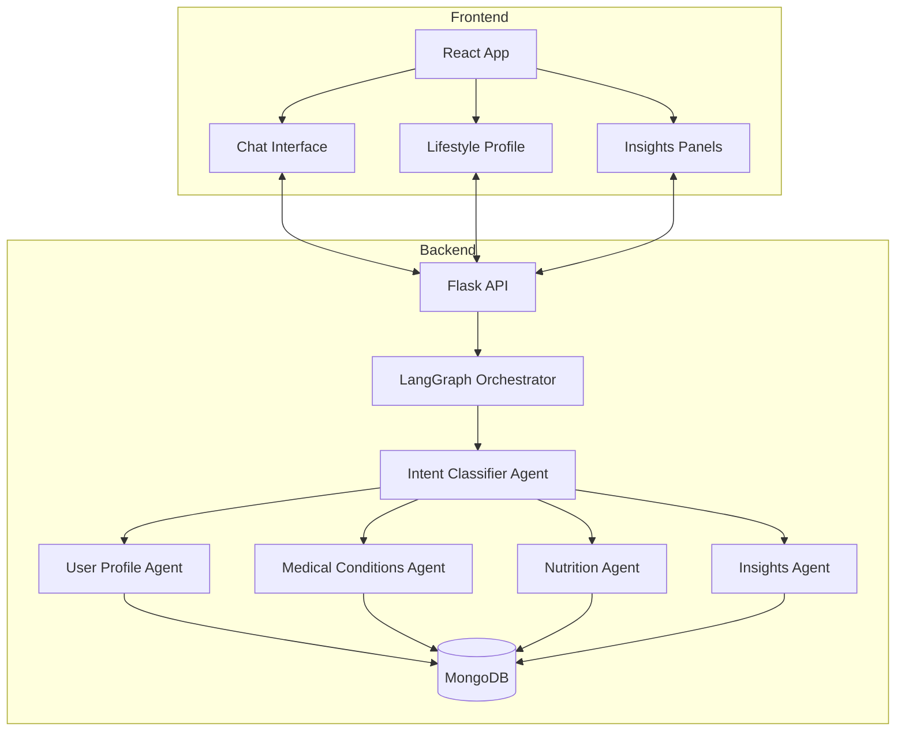
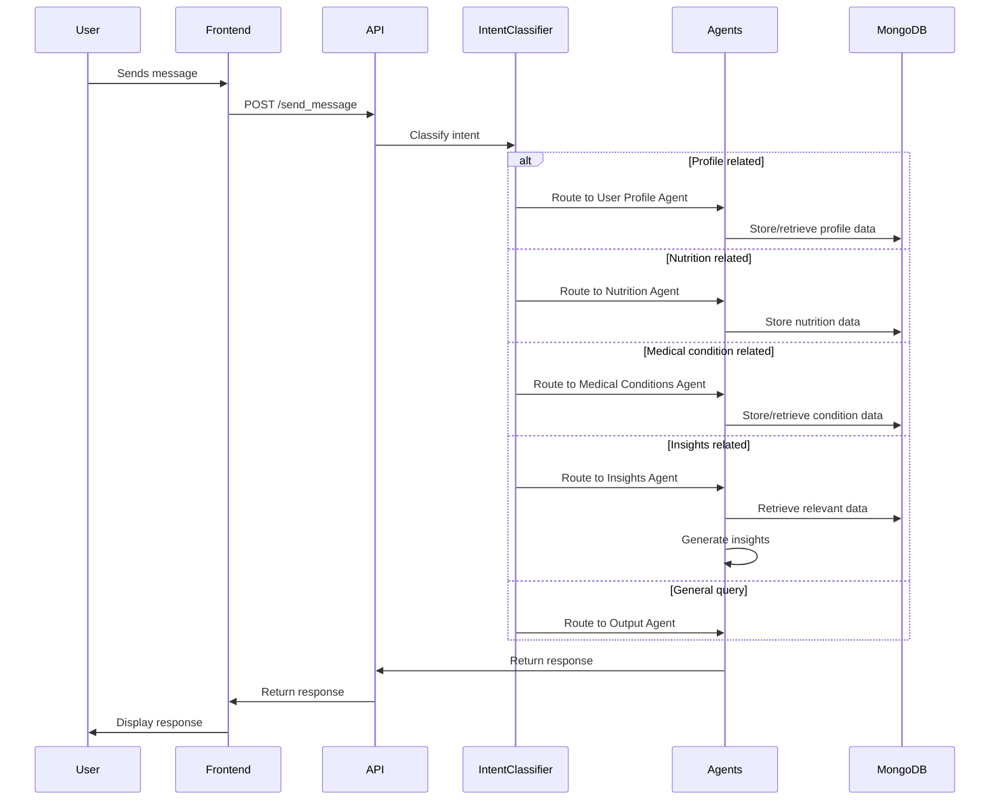

# MediAssist

A health assistant application that helps users manage their health data and provides insights.

## Features

### Speech-to-Text Functionality

MediAssist includes a speech-to-text feature that allows users to record their messages instead of typing them:

- **Hold to Record**: Press and hold the microphone button to start recording your message.
- **Release to Send**: Release the button to automatically transcribe and send your message.
- **Edit Before Sending**: Hold the Shift key while recording, then release to transcribe the text to the input field for editing before sending.

#### How It Works

1. The frontend uses the browser's MediaRecorder API to capture audio.
2. The recorded audio is sent to the backend as a blob.
3. The backend uses OpenAI's gpt-4o-mini-transcribe model via LiteLLM to transcribe the audio.
4. The transcribed text is either automatically sent as a message or placed in the input field for editing, depending on whether the Shift key was held during recording.

#### Visual Indicators

- The microphone button turns red and pulses while recording.
- When the Shift key is held, the button turns blue to indicate that the transcribed text will be placed in the input field instead of being sent automatically.

### Medical Reports Management

MediAssist includes a medical reports management feature that allows users to upload, view, download, and delete their medical reports:

- **Upload Reports**: Users can upload medical reports in various formats (PDF, images, etc.).
- **View Reports**: Users can view a list of all uploaded reports with details like filename, upload date, and file size.
- **Download Reports**: Users can download their reports for viewing or sharing.
- **Delete Reports**: Users can delete reports that are no longer needed.
- **Deep Analysis**: Users can trigger a deep analysis of their medical reports to get personalized insights.

#### How It Works

1. The frontend provides a user interface for uploading and managing medical reports.
2. Files are uploaded to the backend and stored in the 'uploads' directory.
3. File metadata is stored in MongoDB for efficient retrieval and management.
4. The backend provides APIs for uploading, downloading, deleting, and analyzing reports.
5. The Deep Analysis feature uses a specialized AI agent that analyzes the report in context with the user's profile, medical conditions, and nutrition data to provide personalized insights.

## Setup and Installation

# MediAssist: AI-Powered Health Assistant

MediAssist is an intelligent health assistant that helps users track and manage their health information, provides personalized insights, and answers health-related queries using advanced AI.

## Project Overview

MediAssist combines a React frontend with a Python backend powered by LangGraph and LangChain to create a comprehensive health management system. The application processes user inputs, analyzes health data, and provides actionable insights through a conversational interface.

## Architecture



### Frontend (React)
- **Chat Interface**: Allows users to interact with the AI assistant through natural language
- **Lifestyle Profile**: Displays user's basic information and medical conditions
- **Insights Panels**: Shows daily and weekly health insights

### Backend (Python)
- **LangGraph-based Agent System**: Orchestrates multiple specialized agents
- **Intent Classification**: Uses LLM to understand and route user queries
- **Data Storage**: MongoDB for storing user profiles, medical conditions, and nutrition data

## Data Flow



## Key Components

### Agent System
MediAssist uses a sophisticated agent system with specialized components:

- **Orchestrator Agent**: Routes messages to appropriate specialized agents
- **Intent Classifier Agent**: Determines the user's intent from their messages
- **User Profile Agent**: Manages user profile information
- **Medical Conditions Agent**: Handles information about user's health conditions
- **Nutrition Agent**: Processes food and nutrition-related data
- **Insights Agent**: Analyzes data and provides actionable health insights

### Data Models
- **User Profile**: Age, gender, height, weight
- **Medical Conditions**: Condition name, symptoms, treatment, prevention
- **Nutrition Data**: Food name, calories, protein, carbohydrates, fats

## Features

- **Natural Language Understanding**: Process user queries in natural language
- **Health Data Tracking**: Record and monitor health metrics over time
- **Personalized Insights**: Receive tailored health recommendations
- **Medical Condition Management**: Track and learn about medical conditions
- **Nutrition Analysis**: Get insights about food intake and dietary patterns

## Getting Started

### Prerequisites
- Node.js and npm
- Python 3.8+
- MongoDB

### Installation

1. Clone the repository:
```
git clone https://github.com/yourusername/mediassist.git
cd mediassist
```

2. Set up the backend:
```
cd mediassist-backend
pip install -r requirements.txt
```

3. Set up the frontend:
```
cd ../mediassist-frontend
npm install
```

4. Start MongoDB:
```
mongod
```

5. Start the backend server:
```
cd ../mediassist-backend
python -m api.app
```

6. Start the frontend development server:
```
cd ../mediassist-frontend
npm start
```

7. Open your browser and navigate to `http://localhost:3000`

## Usage Examples

### Chat Interface
- Ask health-related questions: "What are the symptoms of the common cold?"
- Record nutrition information: "I had a salad with chicken for lunch"
- Update your profile: "I am 35 years old and weigh 70kg"
- Get nutrition insights: "How's my food intake looking for the past week?"

## Project Structure

```
mediassist/
├── mediassist-backend/         # Python backend
│   ├── agents/                 # Specialized AI agents
│   ├── api/                    # API endpoints
│   ├── graphs/                 # LangGraph flow definitions
│   ├── storage/                # Data models and storage
│   └── tools/                  # Utility tools
│
└── mediassist-frontend/        # React frontend
    ├── public/                 # Static files
    └── src/                    # Source code
        ├── components/         # React components
        └── ...                 # Other frontend files
```

## Technologies Used

- **Frontend**: React, Ant Design
- **Backend**: Python, Flask
- **AI/ML**: LangChain, LangGraph
- **Database**: MongoDB
- **API**: RESTful API

## Future Enhancements

- Integration with wearable devices for real-time health data
- Medication tracking and reminders
- Exercise and activity monitoring
- Advanced visualization of health trends
- Mobile application

## Contributing

Contributions are welcome! Please feel free to submit a Pull Request.

## License

This project is licensed under the MIT License - see the LICENSE file for details.