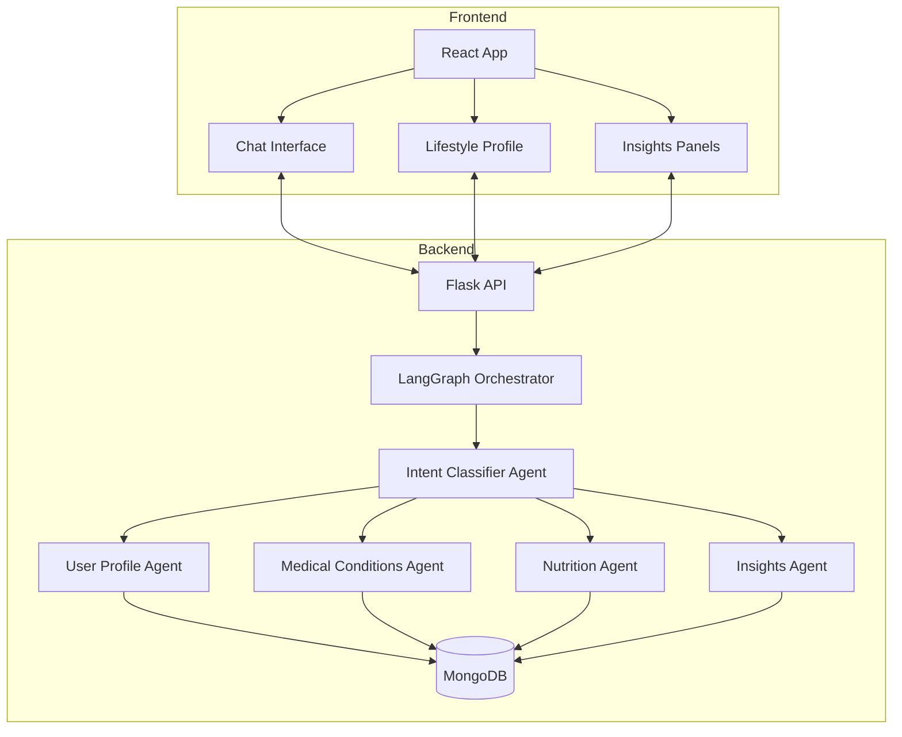
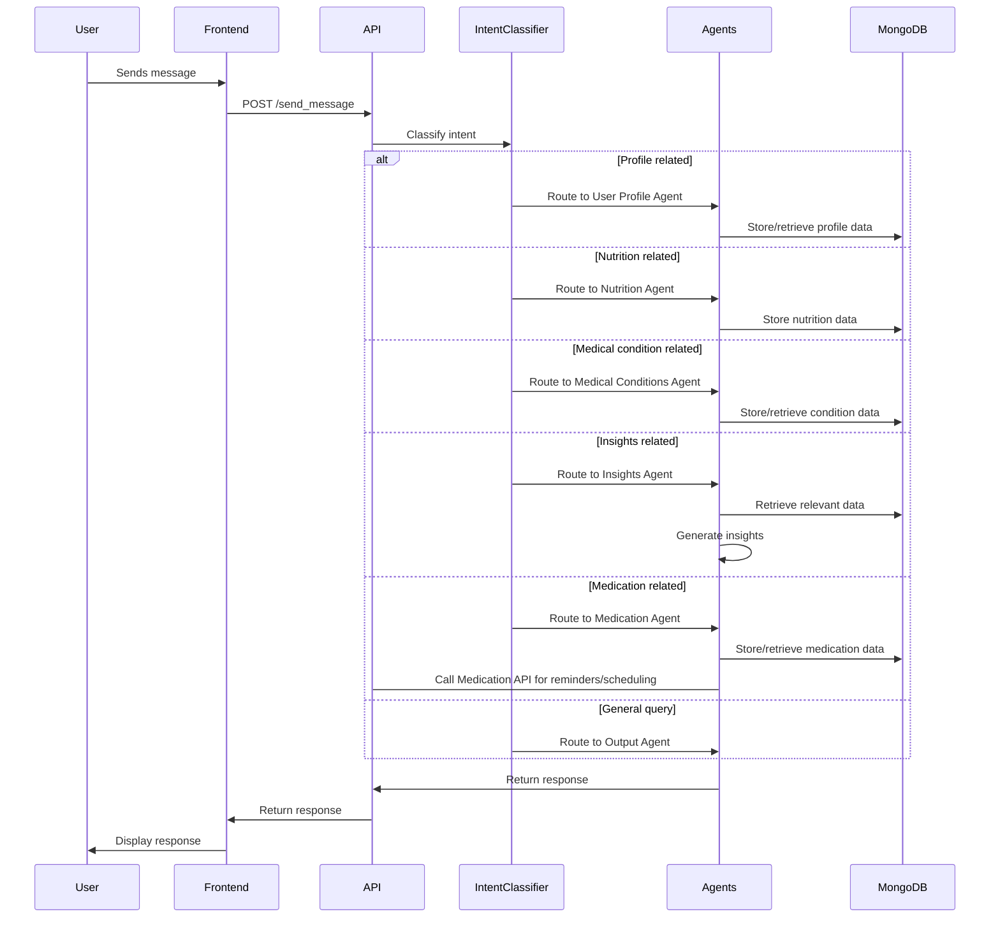

# MediAssist

A health assistant application that helps users manage their health data and provides insights.

## Features

### Speech-to-Text Functionality

MediAssist includes a speech-to-text feature that allows users to record their messages instead of typing them:

- **Hold to Record**: Press and hold the microphone button to start recording your message.
- **Release to Send**: Release the button to automatically transcribe and send your message.
- **Edit Before Sending**: Hold the Shift key while recording, then release to transcribe the text to the input field for editing before sending.

#### How It Works

1. The frontend uses the browser's MediaRecorder API to capture audio.
2. The recorded audio is sent to the backend as a blob.
3. The backend uses OpenAI's gpt-4o-mini-transcribe model via LiteLLM to transcribe the audio.
4. The transcribed text is either automatically sent as a message or placed in the input field for editing, depending on whether the Shift key was held during recording.

#### Visual Indicators

- The microphone button turns red and pulses while recording.
- When the Shift key is held, the button turns blue to indicate that the transcribed text will be placed in the input field instead of being sent automatically.

### Medical Reports Management

MediAssist includes a medical reports management feature that allows users to upload, view, download, and delete their medical reports:

- **Upload Reports**: Users can upload medical reports in various formats (PDF, images, etc.).
- **View Reports**: Users can view a list of all uploaded reports with details like filename, upload date, and file size.
- **Download Reports**: Users can download their reports for viewing or sharing.
- **Delete Reports**: Users can delete reports that are no longer needed.
- **Deep Analysis**: Users can trigger a deep analysis of their medical reports to get personalized insights.

#### How It Works

1. The frontend provides a user interface for uploading and managing medical reports.
2. Files are uploaded to the backend and stored in the 'uploads' directory.
3. File metadata is stored in MongoDB for efficient retrieval and management.
4. The backend provides APIs for uploading, downloading, deleting, and analyzing reports.
5. The Deep Analysis feature uses a specialized AI agent that analyzes the report in context with the user's profile, medical conditions, and nutrition data to provide personalized insights.

## Setup and Installation

# MediAssist: AI-Powered Health Assistant

MediAssist is an intelligent health assistant that helps users track and manage their health information, provides personalized insights, and answers health-related queries using advanced AI.

## Project Overview

MediAssist combines a React frontend with a Python backend powered by LangGraph and LangChain to create a comprehensive health management system. The application processes user inputs, analyzes health data, and provides actionable insights through a conversational interface.

## Architecture


```mermaid
graph TD
    subgraph Frontend
        A[React App] --> B[Chat Interface]
        A --> C[Lifestyle Profile]
        A --> D[Insights Panels]
    end
    
    subgraph Backend
        E[Flask API] --> F[LangGraph Orchestrator]
        F --> G[Intent Classifier Agent]
        G --> H[User Profile Agent]
        G --> I[Medical Conditions Agent]
        G --> J[Nutrition Agent]
        G --> K[Insights Agent]
        
        H --> L[(MongoDB)]
        I --> L
        J --> L
        K --> L
    end
    
    B <--> E
    C <--> E
    D <--> E
```

### Frontend (React)
- **Chat Interface**: Allows users to interact with the AI assistant through natural language
- **Lifestyle Profile**: Displays user's basic information and medical conditions
- **Insights Panels**: Shows daily and weekly health insights

### Backend (Python)
- **LangGraph-based Agent System**: Orchestrates multiple specialized agents
- **Intent Classification**: Uses LLM to understand and route user queries
- **Data Storage**: MongoDB for storing user profiles, medical conditions, and nutrition data

## Data Flow


```mermaid
sequenceDiagram
    participant User
    participant Frontend
    participant API
    participant IntentClassifier
    participant Agents
    participant MongoDB
    
    User->>Frontend: Sends message
    Frontend->>API: POST /send_message
    API->>IntentClassifier: Classify intent
    
    alt Profile related
        IntentClassifier->>Agents: Route to User Profile Agent
        Agents->>MongoDB: Store/retrieve profile data
    else Nutrition related
        IntentClassifier->>Agents: Route to Nutrition Agent
        Agents->>MongoDB: Store nutrition data
    else Medical condition related
        IntentClassifier->>Agents: Route to Medical Conditions Agent
        Agents->>MongoDB: Store/retrieve condition data
    else Insights related
        IntentClassifier->>Agents: Route to Insights Agent
        Agents->>MongoDB: Retrieve relevant data
        Agents->>Agents: Generate insights
    else Medication related
        IntentClassifier->>Agents: Route to Medication Agent
        Agents->>MongoDB: Store/retrieve medication data
        Agents->API: Call Medication API for reminders/scheduling
    else General query
        IntentClassifier->>Agents: Route to Output Agent
    end
    
    Agents->>API: Return response
    API->>Frontend: Return response
    Frontend->>User: Display response
```

## Key Components

### Agent System
MediAssist uses a sophisticated agent system with specialized components:

- **Orchestrator Agent**: Routes messages to appropriate specialized agents
- **Intent Classifier Agent**: Determines the user's intent from their messages
- **User Profile Agent**: Manages user profile information
- **Medical Conditions Agent**: Handles information about user's health conditions
- **Nutrition Agent**: Processes food and nutrition-related data
- **Insights Agent**: Analyzes data and provides actionable health insights
- **Medication Agent**: Manages medication information, schedules, and reminders.

### Data Models
- **User Profile**: Age, gender, height, weight
- **Medical Conditions**: Condition name, symptoms, treatment, prevention
- **Nutrition Data**: Food name, calories, protein, carbohydrates, fats
- **Medication**: User ID, medication name, dosage, frequency, start/end dates, reminder times, notes.

## Features

- **Natural Language Understanding**: Process user queries in natural language
- **Health Data Tracking**: Record and monitor health metrics over time
- **Personalized Insights**: Receive tailored health recommendations
- **Medical Condition Management**: Track and learn about medical conditions
- **Nutrition Analysis**: Get insights about food intake and dietary patterns

### Medication Tracking and Reminders

MediAssist now helps users manage their medications effectively, ensuring they stay on schedule and informed.

**Feature Overview:**
- **Add & Manage Medications**: Users can add new medications with details like name, dosage, frequency, start/end dates, and custom reminder times. Existing medications can be updated or deleted.
- **View Schedule**: Users can view a list of all their current medications and their schedules.
- **Get Reminders**: The system provides reminders for when to take medications. Currently, these reminders are logged on the backend, with frontend components to display due medications.
- **Query Next Dose**: Users can ask when their next dose for a specific medication is due.

**How It Works (Briefly):**
- **Data Model**: A new `Medication` model stores medication details in MongoDB, including `user_id`, `medication_name`, `dosage`, `frequency`, `start_date`, `end_date`, `reminder_times` (list of "HH:MM" strings), and `notes`.
- **API Endpoints**: New RESTful API endpoints under `/api/medications` allow for creating, retrieving, updating, and deleting medication records, as well as fetching medications due for a user.
- **Medication Agent**: A specialized `MedicationAgent` processes user intents related to medications (e.g., adding a new pill, listing current meds, asking about next doses). It interacts with the medication API.
- **Scheduler**: A backend scheduler (`APScheduler`) runs every minute. It checks for active medications whose reminder time matches the current time and logs a reminder message to the server console (e.g., "REMINDER: User 'X' take 'Medication Y' at HH:MM").

**Frontend Components:**
- **Medication Form (`MedicationForm.js`)**: A modal form for adding new medications or editing existing ones. Includes fields for all medication details.
- **Medication List (`MedicationList.js`)**: Displays all of the user's medications in a card layout, with options to edit or delete each entry.
- **Medication Reminders Display (`MedicationReminders.js`)**: Shows a list of medications that are currently considered "due" based on their schedule (active and have reminders set). It can also highlight the next specific reminder time for today if applicable.
- **Medications Page (`MedicationsPage.js`)**: A dedicated page in the frontend that integrates the form, list, and reminders display, providing a complete interface for medication management.

**API Endpoints (for Medication Management):**
- `POST /api/medications`: Add a new medication.
- `GET /api/medications/<user_id>`: List all medications for a specific user.
- `PUT /api/medications/<medication_id>`: Update an existing medication.
- `DELETE /api/medications/<medication_id>`: Delete a medication.
- `GET /api/medications/due/<user_id>`: Get medications that are currently active and have reminders set.

**Usage Examples (Chat Interface):**
Users can interact with the medication features via the chat:
- *"Add a new medication: Lipitor 10mg, take one tablet every evening at 8 PM, starting today."*
- *"What medications am I currently taking?"*
- *"Update my Lipitor dosage to 20mg."* (Note: The system will likely ask for the medication ID for confirmation)
- *"Remove Aspirin from my list."* (Note: ID confirmation might be requested)
- *"What pills should I take now?"*
- *"When is my next dose of Metformin?"*

## Getting Started

### Prerequisites
- Node.js and npm
- Python 3.8+
- MongoDB

### Installation

1. Clone the repository:
```
git clone https://github.com/yourusername/mediassist.git
cd mediassist
```

2. Set up the backend:
```
cd mediassist-backend
pip install -r requirements.txt
```

3. Set up the frontend:
```
cd ../mediassist-frontend
npm install
```

4. Start MongoDB:
```
mongod
```

5. Start the backend server:
```
cd ../mediassist-backend
python -m api.app
```

6. Start the frontend development server:
```
cd ../mediassist-frontend
npm start
```

7. Open your browser and navigate to `http://localhost:3000`

## Usage Examples

### Chat Interface
- Ask health-related questions: "What are the symptoms of the common cold?"
- Record nutrition information: "I had a salad with chicken for lunch"
- Update your profile: "I am 35 years old and weigh 70kg"
- Get nutrition insights: "How's my food intake looking for the past week?"

## Project Structure

```
mediassist/
├── mediassist-backend/         # Python backend
│   ├── agents/                 # Specialized AI agents
│   ├── api/                    # API endpoints
│   ├── graphs/                 # LangGraph flow definitions
│   ├── storage/                # Data models and storage
│   └── tools/                  # Utility tools
│
└── mediassist-frontend/        # React frontend
    ├── public/                 # Static files
    └── src/                    # Source code
        ├── components/         # React components
        └── ...                 # Other frontend files
```

## Technologies Used

- **Frontend**: React, Ant Design
- **Backend**: Python, Flask
- **AI/ML**: LangChain, LangGraph
- **Database**: MongoDB
- **API**: RESTful API

## Future Enhancements

- Integration with wearable devices for real-time health data
- Exercise and activity monitoring
- Advanced visualization of health trends
- Mobile application
- Enhanced notification system for medication reminders (e.g., push notifications, email)

## Contributing

Contributions are welcome! Please feel free to submit a Pull Request.

## License

This project is licensed under the MIT License - see the LICENSE file for details.